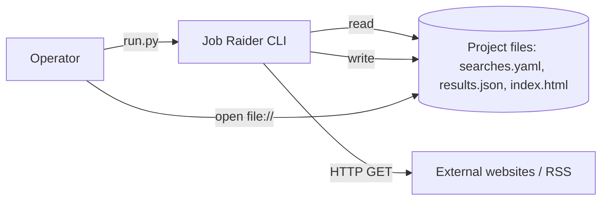
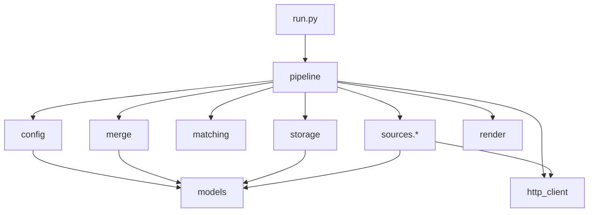

# System Architecture — Job Raider (Phase 1)

**Related PRD:** `_bmad-output/planning-artifacts/prd-job-raider.md` (locked)

This document defines the **technical shape** for Phase 1: a local Python pipeline (`run.py` → fetch → merge → `results.json` → `index.html`), aligned with **FR1–FR23** and **NFR1–NFR10**.

---

## 1. Architectural goals

| Goal | Approach |
|------|----------|
| **Boring, shippable stack** | Python 3.11+, stdlib + PRD-approved libs only (`requests`, `beautifulsoup4`, `feedparser`, `PyYAML`). |
| **Config-driven sources** | YAML describes searches and source instances; **adapter** chosen by string id; URLs/params stay in YAML. |
| **Fail-fast config** | Validate YAML **before** constructing HTTP client or scheduling fetches (FR6, NFR1). |
| **Isolated failure** | One source adapter throws or returns error → pipeline logs and continues (FR11). |
| **Testable core** | Pure functions for merge/sort/filter; adapters behind a narrow interface; fixtures for HTML/RSS samples. |

---

## 2. C4-style views

### 2.1 System context



- **No server**, **no database**; browser reads static `index.html`.

### 2.2 Container (single process)

One OS process, one thread for Phase 1 (sequential fetches with politeness delays).

| Concern | Responsibility |
|---------|------------------|
| **CLI / orchestration** | Parse argv (minimal), load config, run pipeline, exit code. |
| **Config** | Load `searches.yaml`, schema validation, derive effective keywords per source (region append). |
| **Fetch** | HTTP session, timeouts, retries, optional robots check, call adapters. |
| **Normalize** | Raw records → `Opportunity` model; dedupe id; `published_at` nullable. |
| **Merge & retain** | Load prior JSON, upsert by dedupe key, refresh `last_seen_at` only for items **seen this run**, prune >30d. |
| **Render** | Read merged model → escaped HTML, inline CSS. |

### 2.3 Component diagram (Python packages)



---

## 3. Repository & module layout

Proposed layout (implementation target):

```text
job-raider/
├── run.py                      # Thin entry: sys.path + pipeline.run()
├── pyproject.toml or requirements.txt
├── searches.yaml               # User-owned (example: searches.example.yaml in repo)
├── results.json                # Generated (gitignored by default)
├── index.html                  # Generated (gitignored optional)
├── docs/
│   ├── configuration.md        # YAML schema, adapter params (NFR7)
│   ├── results-schema.md       # JSON schema narrative + examples
│   └── architecture.md         # Optional copy or link to this file
└── job_raider/
    ├── __init__.py
    ├── pipeline.py             # Orchestration only
    ├── config.py               # Load + validate YAML → SearchConfig list
    ├── models.py               # Dataclasses / TypedDict for Opportunity, RunMeta
    ├── matching.py             # OR keyword filter, region-as-keyword expansion
    ├── merge.py                # Dedupe, last_seen_at, 30-day prune
    ├── storage.py              # Atomic write results.json
    ├── render.py               # index.html builder + html.escape
    ├── http_client.py          # Session, delays, robots, retry policy
    ├── logging_config.py       # Optional: structured-ish stdout
    └── sources/
        ├── __init__.py         # Adapter registry
        ├── base.py             # Protocol + SourceContext
        ├── rss.py              # feedparser adapter
        └── html_selectors.py   # Generic BS4 list extraction via YAML selectors
```

**Rationale:** Keeps `run.py` at repo root (FR21); packages all logic under `job_raider/` for imports and tests.

---

## 4. Runtime pipeline (ordered steps)

1. **Load & validate config** (`config.load_searches(path)`)  
   - If YAML parse error or schema error → **stderr message + `sys.exit(1)`** — **no** `requests` calls (FR6).

2. **Resolve effective query inputs per source** (`matching.expand_search_context`)  
   - Base keywords from search.  
   - If `region` set: pass to adapters that support native region params; for others, append region string to **effective keyword list** for filtering only, or pass as extra query tokens for adapters that build URLs (adapter-specific; see §6).

3. **Initialize HTTP client** (only after step 1 succeeds)  
   - Session with User-Agent identifying project + version (good citizenship).  
   - Default **timeout** e.g. **30s connect + 30s read** (tunable constant).  
   - **Retries:** max **2** retries on idempotent GET for **connection errors / 429 / 503** with exponential backoff **0.5s, 1.5s** (bounded, NFR2).  
   - **Politeness:** default **750ms–1500ms** jittered delay between HTTP calls (NFR4).

4. **Optional robots.txt gate** (NFR3)  
   - Before first GET to a **netloc**, parse `robots.txt` via `urllib.robotparser` (stdlib).  
   - If **disallow** for User-Agent on URL: **skip** that source with clear log line (treat as source-level failure, not global).  
   - Document limitation: robots cache is per-run (simplest).

5. **Execute searches sequentially** (order = YAML order unless sorted by `id` for stability — pick **YAML order** for predictability, document in docs).

6. **Per search → per source**  
   - Resolve adapter by `adapter` string from config.  
   - Adapter returns `list[RawItem]` or raises `AdapterError`.  
   - Log `success | empty | error` with search id + source label (FR22).

7. **Normalize** each `RawItem` → `Opportunity`  
   - Required: `title`, `source` (label), `url`, `search_id`, `search_name`.  
   - `published_at`: `datetime | None` → JSON **null** if None.  
   - Compute **`dedupe_id`** (§8).

8. **Keyword OR filter** (`matching.matches_keywords`)  
   - Case-insensitive substring match on **title** and optional **summary** field if populated.  
   - Match if **any** keyword in expanded list hits (PRD §1.1).

9. **Accumulate “seen this run”**  
   - Set of `dedupe_id` for all opportunities that survived filter and came from **successful** adapter returns this run.

10. **Merge with previous `results.json`** (`merge.merge_run`)  
    - Load existing file if present; tolerate missing file (cold start).  
    - Upsert by `dedupe_id`.  
    - For each upserted opportunity **in seen-this-run**: set `last_seen_at` = **current run timestamp** (UTC ISO Z).  
    - For opportunities **not** in seen-this-run: **do not** change `last_seen_at`.  
    - Refresh `title`, `published_at`, `url` if newly parsed values present (URL changes rare; document behavior: keep latest title/date from latest parse).

11. **Prune** (`merge.prune_stale`)  
    - Remove records where `now_utc - last_seen_at > 30 days` (PRD).

12. **Persist** (`storage.write_results_atomic`)  
    - Write to temp file in same dir, `os.replace` for atomicity on POSIX.

13. **Render HTML** (`render.write_index`)  
    - Read canonical in-memory model post-merge (or re-read JSON).  
    - Apply sort rules (§9).  
    - Escape all dynamic text (`html.escape`).  
    - Write `index.html`.

14. **Exit code**  
    - `0` if config OK and pipeline completed (even with partial source errors).  
    - `non-zero` if config invalid or unrecoverable IO error; optional `non-zero` if **all** sources failed — **product choice:** recommend **0** with clear log if any data written, **1** only when no write possible — document in README.

**Recommendation:** Exit **0** when `results.json` + `index.html` written successfully; exit **1** on config failure; exit **1** if merge/write fails. Partial source errors alone → still **0** (FR11).

---

## 5. Configuration schema (`searches.yaml`)

Normative for implementation; full prose in `docs/configuration.md`.

```yaml
version: 1

defaults:                      # optional
  request_timeout_seconds: 30
  polite_delay_ms: 1000

searches:
  - id: example_search          # stable id; slug [a-z0-9_]+ recommended
    name: "Human readable title"
    keywords: ["kw1", "kw2"]    # OR semantics after expansion
    region: "Lazio"             # optional; best-effort per §6
    sources:
      - adapter: rss
        label: "Example RSS"
        url: "https://example.com/feed.xml"
      - adapter: html_selectors
        label: "Example portal"
        url: "https://example.com/listings"
        item: "article.job"                    # BS4 selector: repeating item
        title: "h2 a"                          # relative to item
        link: "h2 a"                           # href
        date: "time[datetime]"                 # optional; attr or text
        link_base: "https://example.com"       # optional resolve relative URLs
        date_format: "auto"                    # optional hint
```

**Validation rules (fail fast):**

- Top-level `searches` non-empty list.  
- Each search: `id`, `name`, `keywords` (non-empty list of non-empty strings), `sources` (non-empty).  
- Each source: `adapter` (registered string), `label` (non-empty), adapter-specific required keys (enforced per adapter schema in code).  
- Unknown `adapter` → **clear error listing valid adapters**.

**Version field:** If present and unsupported → error with hint.

This resolves PRD §15 “source definition format” as: **adapter + params** in YAML; no hard-coded site list.

---

## 6. Source adapters

### 6.1 Interface

```python
# Conceptual — actual code in implementation
class SourceContext:
    search_id: str
    search_name: str
    keywords: list[str]          # already OR-expanded base keywords
    region: str | None
    source_label: str
    params: dict                 # YAML subtree for this source

class SourceAdapter(Protocol):
    name: str  # registry key

    def fetch(self, ctx: SourceContext, http: HttpClient) -> list[RawItem]: ...
```

**Region (FR5, PRD §1.1):**

- Each adapter declares `supports_native_region: bool`.  
- If `True` and `ctx.region` set: pass into URL builder or query params (document per adapter).  
- If `False` and `ctx.region` set: `matching` adds region string to **keyword list used for post-filter only** (and adapters that embed keywords into URL may receive `ctx.expanded_keywords` from orchestrator).

### 6.2 Phase 1 built-in adapters

| `adapter` | Purpose | Libraries |
|-----------|---------|-----------|
| **`rss`** | Fetch URL, `feedparser.parse`, map entries to `RawItem` (title, link, summary, published). | feedparser, requests |
| **`html_selectors`** | GET URL, BS4 parse, for each `item` node extract `title`, `link`, optional `date` via selectors relative to item. | bs4, requests |

**Extensibility (NFR6):** New adapter = new module registering `name` in `sources/__init__.py` (dict). No changes to merge/render.

### 6.3 Raw → Opportunity normalization

- `url`: `urllib.parse.urljoin` with `link_base` if relative.  
- `published_at`: parse RSS `published_parsed` / HTML time; on failure → `None` → JSON `null`.  
- `source`: `label` from YAML.  
- `search_id` / `search_name` from parent search.

---

## 7. HTTP client (NFR2–NFR4)

- **`requests.Session`** with headers: `User-Agent: JobRaider/0.1 (+https://github.com/...)` (placeholder URL in README).  
- **Timeouts:** connect + read as constants (overridable via `defaults` in YAML later — optional Phase 1).  
- **Retries:** implemented via small wrapper or `urllib3` retry (if avoiding extra dep, manual retry loop **3 attempts** max for GET).  
- **Rate limiting:** global `sleep` between requests across all sources (simple lockstep queue).  
- **TLS:** default `requests` cert bundle.

---

## 8. Identity, deduplication, merge

### 8.1 Dedupe id

**Primary:** `normalize_url(url)`

Normalization steps (document in `docs/results-schema.md`):

1. Parse with `urllib.parse.urlparse`.  
2. Lowercase **host**.  
3. Strip **fragment** (`#...`).  
4. Drop default ports.  
5. Optional: strip common tracking query params (conservative list or none in v1 — recommend **none** in v1 to avoid accidental collisions).

**Collision handling:** If two different logical jobs share URL (rare), they collapse to one record — document as known limitation.

### 8.2 `last_seen_at` semantics (PRD-aligned)

- Stored as **UTC** ISO-8601 with `Z` suffix.  
- Updated **only** if opportunity is in the **current run’s merged fetch set** after filters (§4 step 9–10).  
- **Edge case (documented):** If a source fails temporarily, items only listed there may **not** refresh `last_seen_at` and can be **pruned after 30 days** even if still live on the website. Mitigation: operator fixes source or deletes `results.json` cold start.

---

## 9. Sorting & “new” badge (rendering logic)

**Timezone:** `zoneinfo.ZoneInfo("Europe/Rome")` (stdlib).

**Run timestamp:** `run_generated_at` in JSON metadata as UTC ISO Z (wall clock when write happens).

**Badge “new”:**

1. If `published_at` is `null` → **no badge**.  
2. Parse `published_at` to aware datetime; if **naive**, assume **Europe/Rome** (document).  
3. Convert `published_at` and `run_generated_at` to **Europe/Rome** for comparison window.  
4. Badge if `0 ≤ (run_time_rome - published_at_rome) ≤ 48 hours`.

**Sort within a search section:**

1. Partition into dated vs `null` date.  
2. Dated: sort **descending** by `published_at` (aware, compare in UTC internally or Rome — consistent).  
3. `null` dates block: sort **ascending** by `title` (casefold) as stable tie-breaker.  
4. Secondary tie for dated: `title` casefold.

**Cross-search order:** Sort sections by `search_name` or `search_id` — recommend **`search_id` ascending** for stable diffs (SC5).

---

## 10. `results.json` canonical shape

Narrative schema; examples in `docs/results-schema.md`.

```json
{
  "schema_version": 1,
  "generated_at": "2026-03-19T14:00:00Z",
  "tool_version": "0.1.0",
  "searches": [
    {
      "id": "example_search",
      "name": "Human readable title",
      "items": [
        {
          "dedupe_id": "https://example.com/job/1",
          "title": "…",
          "source": "Example RSS",
          "url": "https://example.com/job/1",
          "published_at": "2026-03-18T10:00:00+01:00",
          "last_seen_at": "2026-03-19T14:00:00Z",
          "search_id": "example_search",
          "search_name": "Human readable title"
        }
      ]
    }
  ]
}
```

- **`items` array order:** already **sorted** on write (helps deterministic git diff and simple renderer).  
- **`published_at`:** string ISO or `null`.

---

## 11. HTML dashboard (`index.html`)

- **Single file**, **inline CSS** (PRD §10.2).  
- Semantic structure: `<main>`, `<section per search>`, `<ul><li>` or table — prefer **list** for simplicity.  
- **Escape** title, source, URL display text, search names (NFR9).  
- **New badge:** `<span class="badge badge--new">New</span>` with muted palette, accessible contrast.  
- **Dates:** format for display in **Europe/Rome** (e.g. `YYYY-MM-DD HH:mm` with small note “Europe/Rome” in footer optional).  
- **No external assets** required (offline-friendly).

---

## 12. Logging & observability

- **Stdout** structured lines, e.g.  
  `[INFO] search=pnrr source=InPA adapter=rss status=ok count=12`  
  `[ERROR] search=pnrr source=USR adapter=html_selectors error="timeout"`  
- Optional `--verbose` flag (future-friendly; Phase 1 can be always-info).  
- No log file required (PRD leaves choice open); recommend **stdout only** for Phase 1.

---

## 13. Security & safety

- **XSS:** `html.escape` on all interpolated text; URLs in `href` validated minimally (must start with `http://` or `https://` — else render as text only or skip with log).  
- **SSRF:** Document that operators must only point YAML at trusted public URLs; tool has no auth secrets (NFR8).  
- **YAML:** Safe load with `yaml.safe_load` only.

---

## 14. Testing strategy (recommended)

| Layer | Tests |
|-------|--------|
| **config** | Invalid YAML, missing fields, unknown adapter — assert exit before HTTP (mock or no network). |
| **matching** | OR keyword matrix; region expansion. |
| **merge** | Upsert, `last_seen_at` refresh only when seen, prune boundary at 30d. |
| **render** | Snapshot HTML for fixture JSON; badge presence/absence; `null` date ordering. |
| **adapters** | Offline fixtures: sample RSS XML and HTML snippets on disk. |

Use `pytest` if added as **dev** dependency; not required in PRD runtime deps — acceptable as optional dev extra in `pyproject.toml`.

---

## 15. ADR summary

| ADR | Decision | Alternatives rejected |
|-----|----------|------------------------|
| **ADR-01** | Single-process sequential pipeline | Async/concurrency — unnecessary complexity for Phase 1. |
| **ADR-02** | Adapter registry keyed by YAML `adapter` string | Auto-discovery plugins — overkill. |
| **ADR-03** | Dedupe by normalized URL | Hash title+source — unstable titles. |
| **ADR-04** | `last_seen_at` only on appearance this run | “Sticky” last_seen on partial failure — not in PRD. |
| **ADR-05** | stdlib `html.escape` + string template for HTML | Jinja2 — extra dependency beyond PRD list. |
| **ADR-06** | Atomic JSON write via temp + replace | In-place write — risk corrupt file on crash. |
| **ADR-07** | robots.txt check via stdlib `robotparser` | Ignore robots — conflicts with NFR3. |

---

## 16. Traceability matrix (PRD → architecture)

| PRD area | Where addressed |
|----------|-----------------|
| FR1–FR6 | §5 config schema, §4 step 1–2, §6 adapters |
| FR7–FR11 | §4 steps 3–6, §7 HTTP, §6 adapters |
| FR12–FR15b | §8 merge, §10 JSON, §4 steps 10–12 |
| FR16–FR20 | §9 sort/badge, §11 HTML |
| FR21–FR23 | §3 layout, §12 logging, `docs/` |
| NFR1 | §4 ordering, exit codes |
| NFR2 | §7 timeouts/retries |
| NFR3–NFR5 | §4 step 4, §13, README legal note |
| NFR6 | §6 registry |
| NFR7 | `docs/` |
| NFR8–NFR9 | §5 safe_load, §11 escape, §13 URL scheme |
| NFR10 | §7 sequential + delays — expect minutes max |

---

## 17. Implementation sequencing (suggested)

1. `models`, `config` validation, golden-path tests for invalid YAML.  
2. `http_client` + `rss` adapter + `matching`.  
3. `merge` + `storage`.  
4. `html_selectors` adapter (1–2 fixtures).  
5. `render` + `pipeline` + `run.py`.  
6. `docs/` + `searches.example.yaml`.  
7. Hardening: robots, retries, prune edge tests.

---

*End of Architecture — Job Raider Phase 1*
